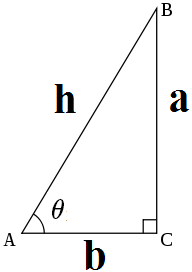

# 平面集合三角相关

## 三角形
已知三角形三点坐标$(x_1,y_1),(x_2, y_2),(x_3,y_3)$时，三角形的面积：$S=\frac{(x_2-x_1)\times{(y_3-y_1)-(y_2-y_1)\times{(x_3-x_1)}}}{2}$  
``` c++
#include <algorithm>
#include <vector>

using namespace std;
using ll = long long;
using pll = pair<ll, ll>;

pll operator-(const pll &a, const pll &b) { return {a.first - b.first, a.second - b.second}; }
ll cross(const pll &a, const pll &b) { return a.first * b.second - a.second * b.first; }

int n; vector<pll> pos(n);
auto area = [&](int u, int v, int w) { return abs(cross(pos[v] - pos[u], pos[w] - pos[u]) / 2); };
```

## 三角函数
### 定义
#### 以直角三角形来定义
  
股（对边a）、勾（领边b）、弦（斜边h）  

$正弦\sin{\theta}=\frac{a}{h}$  
$余弦\cos{\theta}=\frac{b}{h}$  
$正切\tan{\theta}=\frac{a}{b}$  
$余切\cot{\theta}=\frac{b}{a}$  
$正割\sec{\theta}=\frac{h}{b}$  
$余割\csc{\theta}=\frac{h}{a}$  

割线是从圆外引一点和圆交于两点的线

#### 单位元定义
  


### 性质

正弦函数、正切函数、余切函数、余割函数是奇函数，余弦函数和正割函数是偶函数。  

$\tan{\theta}\cot{\theta}=1$  
$\sin{\theta}\csc{\theta}=1$  
$\cos{\theta}\sec{\theta}=1$  

$\tan{\theta}=\frac{\sin{\theta}}{\cos{\theta}}$  
$\cot{\theta}=\frac{\cos{\theta}}{\sin{\theta}}$  
 
#### 三角恒等式
`毕达哥拉斯恒等式`: $\sin{^2}{x}+\cos{^2}{x}=1$  
$\tan{^2}{\theta}+1=\sec{^2}{\theta}$  
$1+\cot{^2}{\theta}=\csc{^2}{\theta}$  

| 函数 | $\sin{\theta}$ | $\cos{\theta}$| $\tan{\theta}$| $\cot{\theta}$| $\sec{\theta}$| $\csc{\theta}$|
| ---- | ---- | ---- | ---- | ---- | ---- | ---- |
| $\sin{\theta}$ | $\sin{\theta}$ | | | | | |
| $\cos{\theta}$ | $\sqrt{1-\sin{^2}{\theta}}$ | | | |  | |
| $\tan{\theta}$ | $\frac{\sin{\theta}}{\sqrt{1-\sin{^2}{\theta}}}$ | | | | | |
| $\cot{\theta}$ | $\frac{\sqrt{1-\sin{^2}{\theta}}}{\sin{\theta}}$ | | | | | |
| $\sec{\theta}$ | $\frac{1}{\sqrt{1-\sin{^2}{\theta}}}$ | | | | | |
| $\csc{\theta}$ | $\frac{1}{\sin{\theta}}$| | | | | |  

带$\sqrt{}$的要视情况选择正负号

##### 和差公式
$\sin{(x+y)}=\sin{x}\cos{y}+\cos{x}\sin{y}$  
$\sin{(x-y)}=\sin{x}\cos{y}-\cos{x}\sin{y}$  

$\cos{(x+y)}=\cos{x}\cos{y}-\sin{x}\sin{y}$  
$\cos{(x-y)}=\cos{x}\cos{y}+\sin{x}\sin{y}$  

$\tan{(x+y)}=\frac{\tan{x}+\tan{y}}{1-\tan{x}\tan{y}}$  
$\tan{(x-y)}=\frac{\tan{x}-\tan{y}}{1+\tan{x}\tan{y}}$  
- - -

当两角（x=y）相同时，称为`二倍角公式`  
$\sin{(2x)}=2\sin{x}\cos{x}$  
$\cos{(2x)}=\cos{^2}{x}-\sin{^2}{x}$  
$\tan{(2x)}=\frac{2\tan{x}}{1-\tan{^2}{x}}$
- - -

`半角公式`  
$\sin{\frac{x}{2}}=\pm{\sqrt{\frac{1-\cos{x}}{2}}}$  
$\cos{\frac{x}{2}}=\pm{\sqrt{\frac{1+\cos{x}}{2}}}$  
$\tan{\frac{x}{2}}=\pm{\sqrt{\frac{1-\cos{x}}{1+\cos{x}}}}=
\frac{1-\cos{x}}{\sin{x}}=\frac{\sin{x}}{1+\cos{x}}$  

